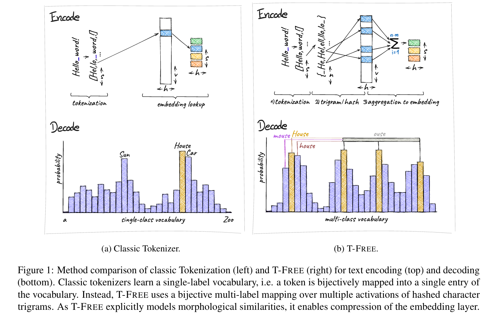
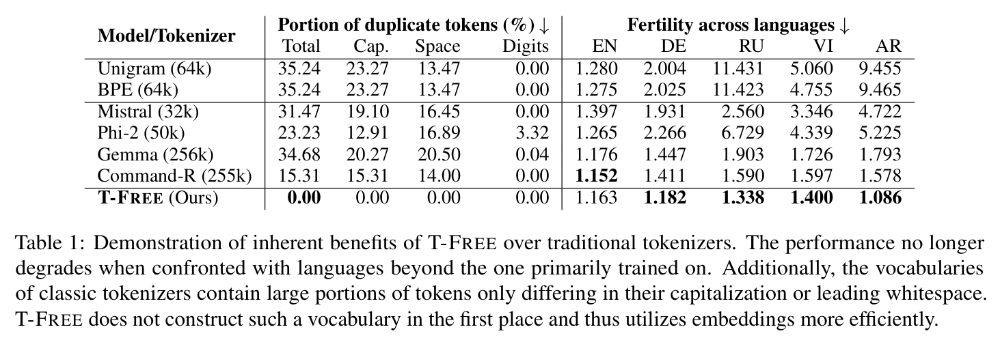
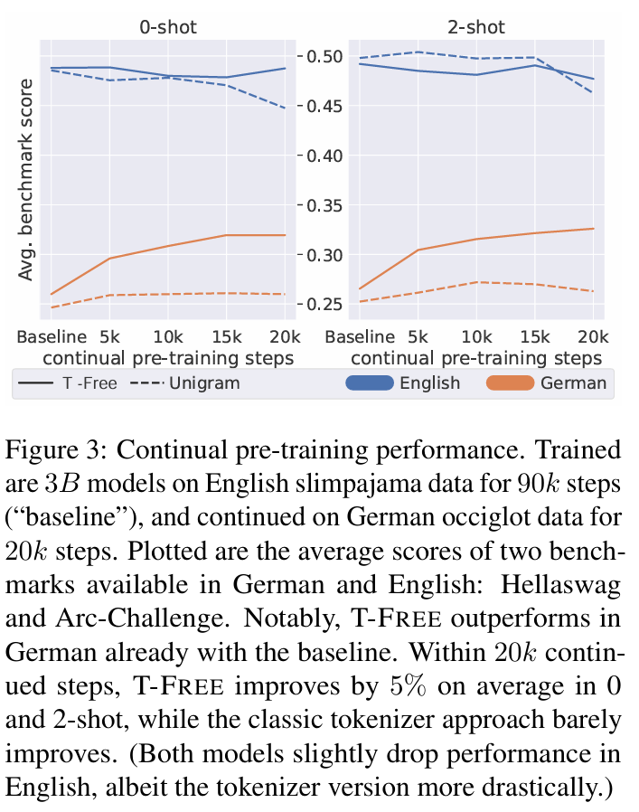
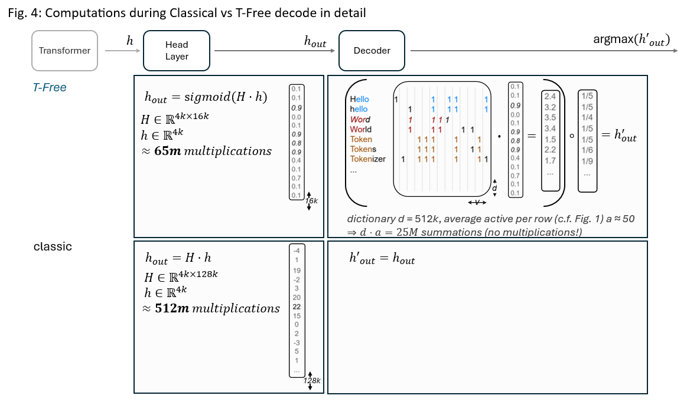

# T-Free: Subword Tokenizer-Free Generative LLMs via Sparse Representations for Memory Efficient Embeddings

Paper link: https://arxiv.org/abs/2406.19223







## Checkpoints
- [7B trained on 1 epoch fineweb-edu](https://huggingface.co/Aleph-Alpha/tfree-research-vocab-32k-fineweb-steps-370k)
- [7B trained on 1 epoch fineweb-edu + continued instruct tuning](https://huggingface.co/Aleph-Alpha/tfree-research-vocab-32k-fineweb-steps-370k-instruct-10k)


## Install

```console
conda create --name t-free python=3.11 -y
conda activate t-free

conda install pytorch==2.1.2 pytorch-cuda=12.1 -c pytorch -c nvidia

pip install -e .[test]

pre-commit install
```

## Running some tests
```
pip install determined==0.26.4

pytest tests/test_data
pytest tests/test_tokenizer
pytest tests/test_trainer
pytest tests/test_inference 
```

## Training

### Data preprocessing
Training requires data to be in one of two formats: MemoryMap or AlignedMemoryMap. MemoryMaps simply store data in byte format with indices for fast random access.
AlignedMemoryMaps build a second index above, that aggregate a minimum byte-count per entry. We use this for pre-training to avoid the need of aggregating a dynamic number of random entries to fill the full sequence length, which becomes hard when trying to ensure that each entry is will only be seen once during one epoch.  

An example of how to download and convert e.g. FinetuneWeb of HuggingFace into a MemoryMap is found in data/download_data.py. 
Note that the data is stored in string format (converted to bytes). Trigramification or classical Tokenization are executed on-demand during training, depending on the respective training configurations.

To further convert the data into an AlignedMemoryMap execute e.g. data/convert_mmap_to_alignedmmap.py.
Right now max_bytes is set to 20k, which we found to correlate well to roughly 4k trigram words -- our configured pre-training sequence length.
Note: If sequence length is exceeded, overhead will simply be cut off. If it is not reached with the index, it will be filled with a random further item.

Right now typical instruction finetunings jsonl's need to casted to MemoryMaps as in data/convert_instruct_jsonl_to_mmap.py.

Data in MemoryMap format requires config.data.pretraining = False.
AlignedMemoryMaps require config.data.pretraining = True.

### Launch training
We include example determined configs in determined_configs/ and example training model configs in configs/.
You may launch a training through one of the determined experiments, or respectively convert the torch distributed launcher scripts of the following line to your environment:
```
python3 -m determined.launch.torch_distributed python3 src/trigram_tokenizer/trainer/train_determined.py --config configs/7b_fineweb.yaml
```


## Inference
Minimal Example:
```
# download checkpoint from huggingface
apt-install git-lfs
git clone https://huggingface.co/Aleph-Alpha/tfree-research-vocab-32k-fineweb-steps-370k

# install this repository
pip install -e .

# adjust checkpoint path in inference.py, then run it
python inference.py
```


Run one of the prepared inference* scripts.

Note that the inference decode works different to that of other LLMs.
Currently we build a dictionary with word-patterns and compute the product with the models output logits to select e.g. the next top-word. This is shown in Fig. 4 below.

As such you need/ may want to
- InferencePipe.__init__: pass a path to a collections.Counter pckl file through the "top_word_dict" parameter - these will be converted to the patterns of the respective loaded checkpoint config. We counted once the entire fineweb-edu dataset, a top-k subset is found in data/en_fineweb_top_1m_counter.pckl.
- InferencePipe.__init__: pass an integer through the "reduce_tokenizer_words_to" parameter - these cut off the top n words of aboves collection.
- InferencePipe.generate: pass a "more_words" string - a string of words (separated by whitespaces) that will dynamically be added to the dictionary for on demand sampling.
- InferencePipe.tokenizer.convert_weight_for_word_edge_overweight: will downweight edge-trigrams's as discussed in paper, to reduce artifacts (usually factor < .8).
- call data/generate_tokenizer.py once with a trained checkpoint. This will preprocess once the patterns for the passed dictionary and store them next to the checkpoint. Subsequent calls of InferencePipe.__init__  then do not require to pass the dict but directly load the stored patterns.  



## Known Issues/ Ongoing Research

- in trigram_tokenizer.py/decode_trigram we propose two variants to decode words. we are digging into further improvements / are happy for feedback 


## Cite

```
@article{deiseroth2024t,
  title={T-FREE: Tokenizer-Free Generative LLMs via Sparse Representations for Memory-Efficient Embeddings},
  author={Deiseroth, Bj{\"o}rn and Brack, Manuel and Schramowski, Patrick and Kersting, Kristian and Weinbach, Samuel},
  journal={arXiv preprint arXiv:2406.19223},
  year={2024}
}
```